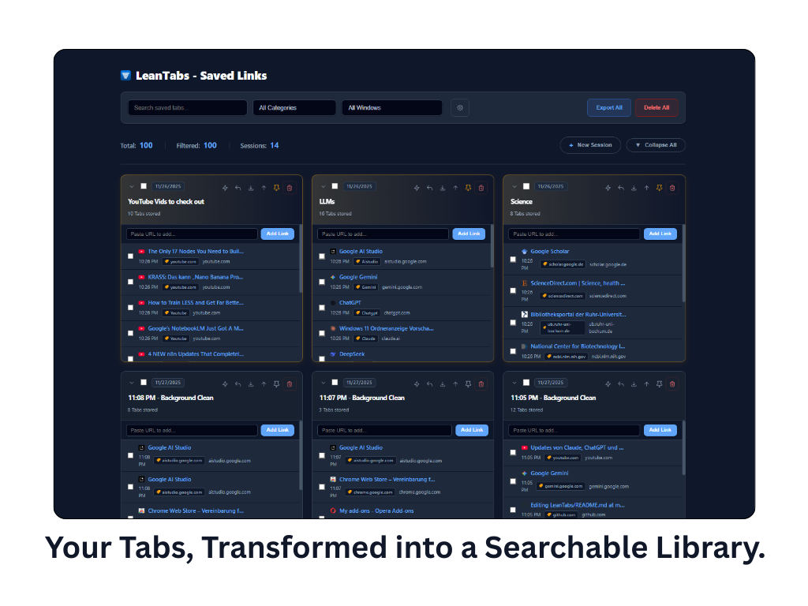
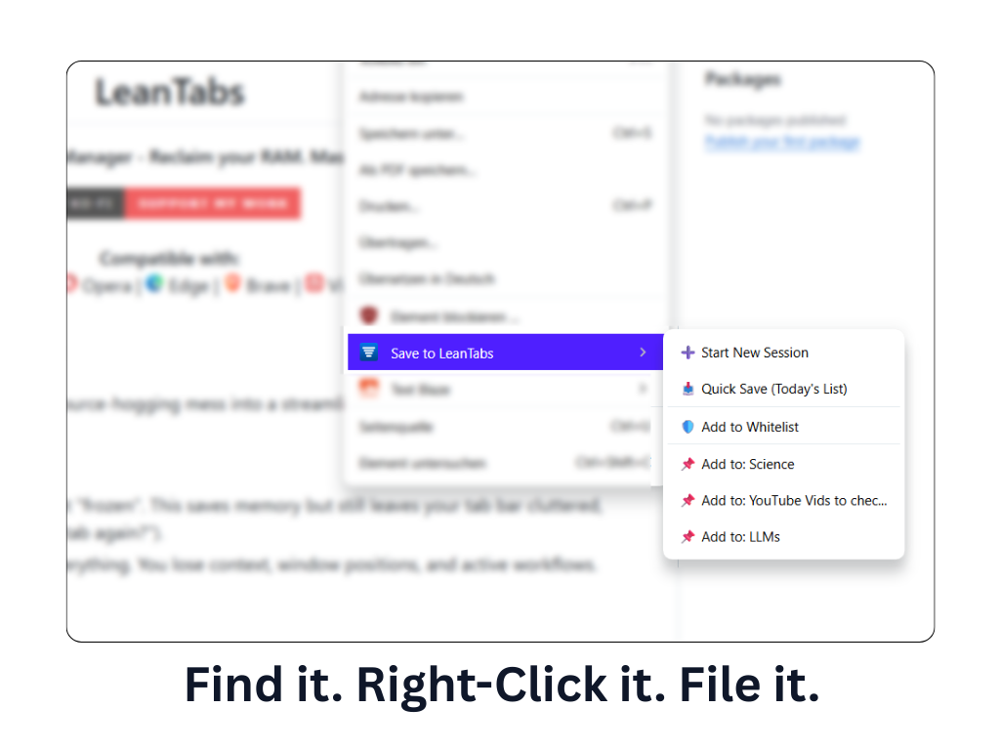
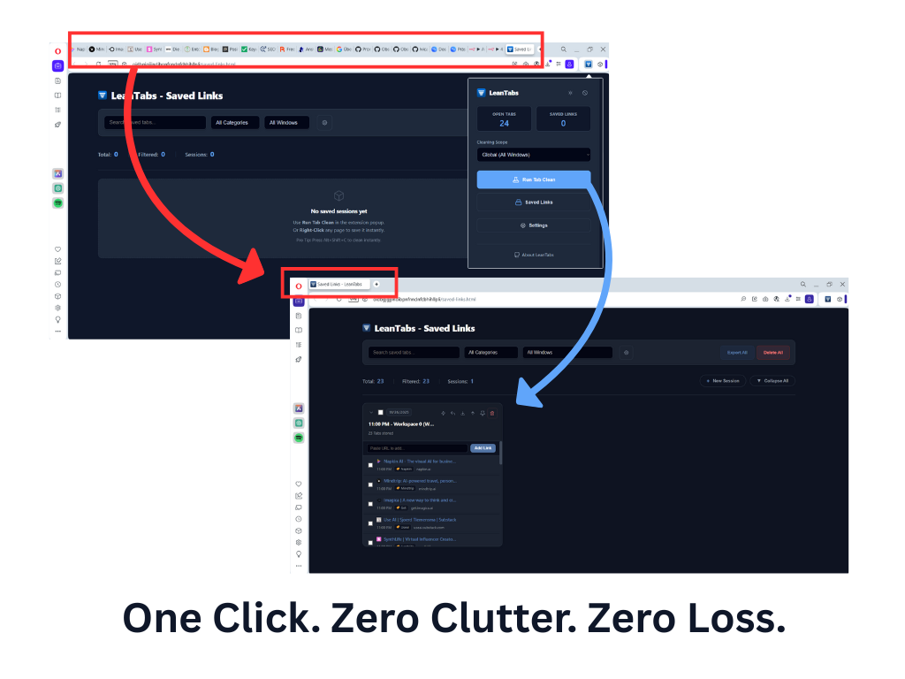
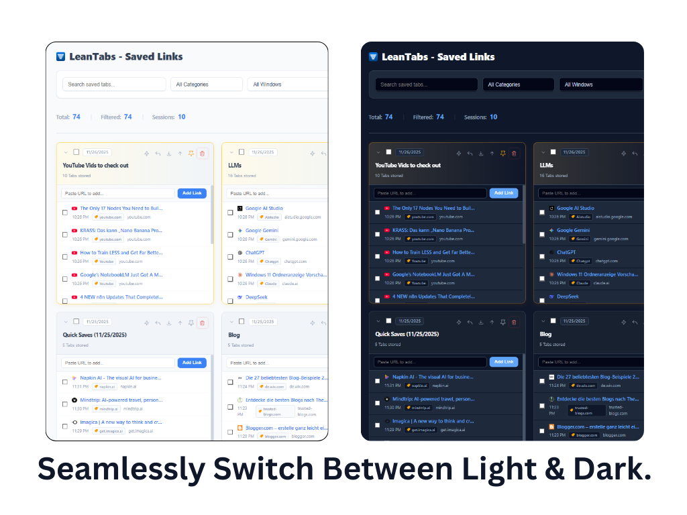
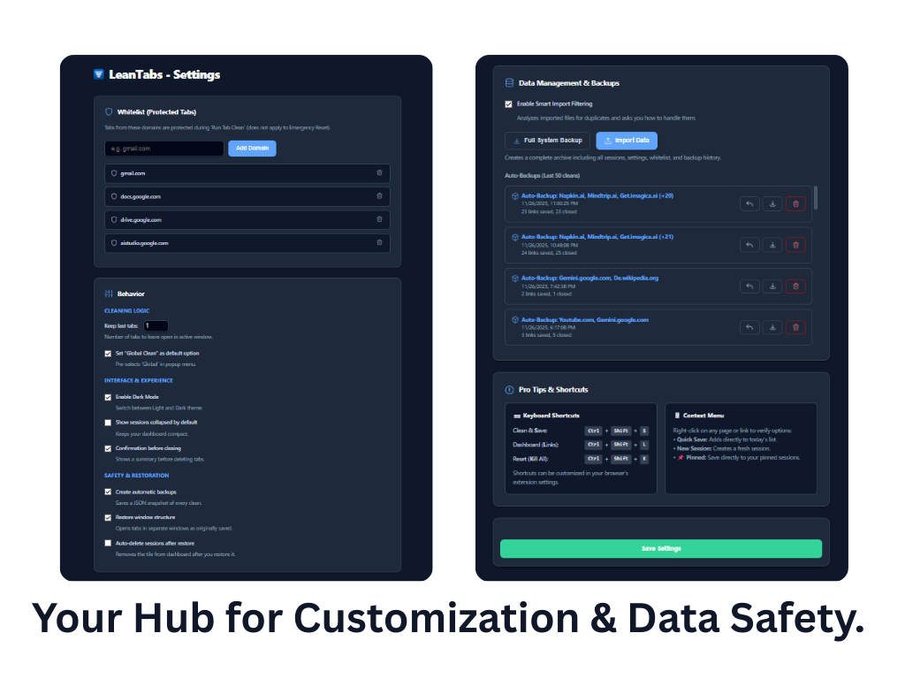

  

  <h1>LeanTabs</h1>

  <h3>Declutter Your Browser, Not Your Brain.</h3>
  
  

    <strong>The Smart Tab & Workspace Manager That Turns Tab Chaos into Your Personal Library.</strong> 
    Reclaim your RAM. Master your Workspaces. Own your data.
  

  

    
  

  

    <strong>Compatible with:</strong> 
     Chrome | 
     Opera | 
     Edge | 
     Brave | 
     Vivaldi
  

 

> **"Don't just suspend your clutter. Solve it."**

**LeanTabs** transforms your browser from a resource-hogging mess into a streamlined productivity machine.

### ⛔ The Problem with other tools
*   **Tab Suspenders:** They freeze tabs to save RAM, but your tab bar remains a chaotic mess of 50 tiny icons. You still carry the cognitive load.
*   **Simple Cleaners:** They ruthlessly close everything. You are left digging through a flat Browser History, losing the grouping and the context of which tabs belonged together.

### ✅ The LeanTabs Solution
LeanTabs is based on a simple philosophy: **Tabs eat RAM. Links don't.**

**A browser with hundreds of open tabs isn't a sign of disorganization; it's a defense mechanism against losing a valuable thought.**

I built LeanTabs to break this cycle. It acts as a **Smart Converter**. Instead of keeping resource-heavy tabs open, it instantly converts them into organized, lightweight **Lists of Links** ("Sessions"). It secures your data first, then selectively clears memory, giving you the performance of a fresh browser with the safety of a full backup.

✨ **Advanced Workspace Support:** LeanTabs is designed for multitaskers. It features native detection for multiple windows and deep integration for things like **Opera Workspaces**, ensuring that your separate project areas remain isolated. Cleaning one project workspace won't kill the tabs in your other active projects.

---

### ⚡ How it works in 3 seconds:
1.  **Select Scope** 🎯 → Choose your cleanup level: Clean just the **Current Window** to tidy up, or perform a **Global Clean** across all screens to reset your workday.
2.  **Click "Clean"** 🧹 → **Instant Zen.** Background clutter vanishes. RAM is freed instantly. Your browser speeds up immediately.
3.  **Tabs become Links** 💾 → **Zero RAM.** LeanTabs converts every single tab (even the ones kept open) into a secure link within a named session.
4.  **Restore Precision** ↩️ → **Resume Flow.** Turn any link back into a live tab. Restore a specific window or an entire workspace setup with one click.

---

## 🚀 Power Features: Why LeanTabs?

### 🧠 Context-Aware Intelligence
LeanTabs distinguishes between your **Active Focus** and **Background Noise**.
*   **Active Window Logic:** In your current window, it keeps your most recent tabs open (customizable, e.g., last 3) so your immediate flow isn't interrupted.
*   **Deep Hibernation:** In "Global Mode", background windows and workspaces are saved as separate Link Sessions and then **closed completely** to maximize system performance.

### 🛡️ Frictionless Protection
Found a site you never want to close (Spotify, CRM, WhatsApp)?
*   **Right-Click Protection:** Simply right-click any page and select **"Add to Whitelist"**.
*   **Domain Lock:** This domain is now whitelisted. LeanTabs will clean around it, keeping your essential tools running while converting the rest into links.

### 🗂️ The Dashboard: A Living Database

The "Saved Links" dashboard turns your browsing history into an organized asset.
*   **Granular Restoration:** Even after a global clean, every window and workspace is saved as a separate tile. You have the freedom to restore specific projects individually, exactly when you need them.
*   **Live Search:** Stop digging through history. Find any link by title, URL, or category instantly.
*   **Smart Organization:** Manage hundreds of sessions easily with collapsible lists and the global "Collapse/Expand" controls.
*   **Smart Categorization:** Automatically detects "YouTube", "GitHub", or "Docs" links and tags them.
*   **Dark Mode:** A beautifully crafted UI that respects your system settings.

### ➕ Research Assistant
You can also add links with a Right-Click or manually to your sessions! Save a URL, and LeanTabs **automatically fetches the page title** for you (e.g., converting a YouTube link into the video title).

### 🏷️ Smart Auto-Categorization
Chaos is the enemy. LeanTabs **automatically detects the source** of every link (e.g., "YouTube", "GitHub", "Amazon") and applies a clean category tag. Want custom organization? You can rename any category tag manually to fit your project needs (e.g., change "Google Docs" to "Thesis Sources").

### 🔒 The "Triple Safety" Net
I engineered LeanTabs to make data loss impossible.
1.  **Session Archives:** Every clean action creates a visible, editable list of links in your dashboard.
2.  **Unified Auto-Backup:** A fail-safe background mechanism that creates a full backup file of *everything* you cleaned. Even if you delete a session by mistake, the global backup has you covered.
3.  **Privacy First:** Your data belongs to you. LeanTabs stores all your sessions and links **locally on your device** (`chrome.storage`). I do not track you, have no analytics, and do not upload your data to any cloud servers.

> *Note: The extension only connects to the internet when you manually add a link (to fetch the title) or to load website icons (favicons).*

---

## 💡 8 Real-World Scenarios: Do you recognize yourself?

### 1. The "Brain Dump" Handover (Collaboration) 🤝
You've spent hours researching a topic with 20+ tabs open. Now you need to pass this knowledge to a colleague.
*   **The Old Way:** Spamming 20 links into Slack or Teams. Context gets lost, links get ignored.
*   **The LeanTabs Way:** Save the session. Click **Export**. Send the tiny `.json` file to your colleague. They use **Smart Import** and instantly have your *exact* research environment on their screen. No Cloud required.

### 2. The "Project Switcher" (Single-Window Flow) ⚡
You manage three different projects ("Client A", "Client B", "Admin"), all safely stored in your LeanTabs dashboard. You need to switch contexts fast.
*   **The LeanTabs Way:** Open your dashboard, find "Client B", and hit the **Replace Icon** (⚡).
*   **The Result:** *Instant Metamorphosis.* The browser wipes the current slate and loads "Client B" in the exact same window. No new windows, no manual cleanup. You swap entire work environments like TV channels.

### 3. The "Surgical Strike" (Workspace Mastery) 🏗️
You use Opera Workspaces or multiple windows to separate "Work" from "Private". You want to clean up your messy work tabs, but you are terrified of accidentally closing your private YouTube playlist in the background.
*   **Others:** Wipe everything blindly.
*   **LeanTabs:** Uses native `workspaceId` detection. It surgically removes tabs *only* in your active context. Your background music and private tabs remain untouched and running.

### 4. The "Project Time Capsule" (Archiving) 📦
You finished a client project. You have 50 tabs open that you don't need *now*, but might need in 6 months for a revision. Bookmarks are a graveyard.
*   **The LeanTabs Way:** Clean the window. Rename the session to "Client X - Final". Export the file and save it directly into the client's folder on your hard drive.
*   **The Benefit:** You keep your browser fast today, but retain 100% of the project context for the future.

### 5. The "Morning Cockpit" (Routine) 🚀
Every day starts with the same 5 tools: Email, Calendar, Jira, Analytics, and Slack. Manually opening them every morning is tedious; having them auto-start makes your browser slow to launch.
*   **The LeanTabs Way:** Create your perfect setup once. Save it and **Pin It** in LeanTabs.
*   **The Benefit:** Your browser launches instantly (empty and fast). One click on your pinned "Morning Cockpit" loads your entire workspace exactly when you are ready to start.

### 6. The "Context Freeze" (For Developers & Researchers) ❄️
You have 20 tabs open for a specific bug fix or thesis chapter. You're done for today, but you can't afford to lose the arrangement of your windows (Code on the left, Docs on the right).
*   **Others:** Save a flat list of URLs. Context is lost.
*   **LeanTabs:** Saves the session *and* the window structure (enable "Restore Window Structure" in settings). One click next week restores the exact window layout, so your mental map stays intact.

### 7. The "Panic" Screen Share (Privacy) 🎥
You are in a meeting and need to share your screen immediately. But you have 40 tabs open—some work, some private (Amazon, Reddit), and it looks chaotic.
*   **The LeanTabs Move:** Click **Global Clean**.
*   **The Result:** In 1 second, your browser is pristine. Only your 3 active work tabs remain. Your private tabs aren't lost—they are safely converted to links in the dashboard, ready to be reopened later.

### 8. The "FPS Hunter" (Performance) 🎮
You want to launch a heavy game (Cyberpunk) or render a 4K video. Chrome is running in the background, consuming resources even when minimized.
*   **The LeanTabs Move:** Don't just minimize Chrome. **Global Clean** it.
*   **The Result:** LeanTabs keeps your browser open (so you don't lose your login sessions) but strips it down to the bare minimum. Your CPU and RAM are fully released for your task.

---

## 👥 Who is LeanTabs for?

*   **Developers & Designers:**
    You work with complex window setups (VS Code left, Docs right). You need to freeze this layout and restore it exactly as is next week.
*   **Agency Owners & Freelancers:**
    You juggle 5 different clients. You need to swap contexts instantly without accidentally mixing up project tabs or leaking data during screen shares.
*   **Researchers & Students:**
    You have 40 tabs open for your thesis. You are afraid to close them because bookmarks are where links go to die. LeanTabs turns them into a safe, searchable archive you can access later for citations.
*   **Performance Minimalists:**
    You hate bloat. You want your browser to consume 200MB of RAM, not 8GB, so your gaming or rendering performance doesn't suffer.
*   **The "Tab Hoarders" (ADHD friendly):**
    You keep tabs open because "out of sight, out of mind". LeanTabs solves the object permanence issue by giving you a visual, searchable dashboard instead of hidden bookmarks.

---

## ⌨️ Keyboard Mastery

For Power Users who hate reaching for the mouse. Remember the keys easily:

| Command | Windows / Linux | Mac | Mnemonic / Logic |
| :--- | :--- | :--- | :--- |
| **Clean & Save** | <kbd>Ctrl</kbd> + <kbd>Shift</kbd> + <kbd>S</kbd> | <kbd>Cmd</kbd> + <kbd>Shift</kbd> + <kbd>S</kbd> | **S** for **S**ave. Runs the clean based on your active **Scope Setting** (Global or Current). |
| **Open Dashboard** | <kbd>Ctrl</kbd> + <kbd>Shift</kbd> + <kbd>L</kbd> | <kbd>Cmd</kbd> + <kbd>Shift</kbd> + <kbd>L</kbd> | **L** for **L**inks. Opens your library of Saved Links. |
| **Emergency Reset** | <kbd>Ctrl</kbd> + <kbd>Shift</kbd> + <kbd>K</kbd> | <kbd>Cmd</kbd> + <kbd>Shift</kbd> + <kbd>K</kbd> | **K** for **K**ill. ⚠️ **Kills** tabs in the **Active Window** only (ignores Scope settings). No saving. |

---

## 📦 Installation

### 🛒 From the Add-on Store
*(Links will be added soon)*
*   🔜 **Chrome Web Store:** *Coming Soon*
*   🔜 **Opera Add-ons:** *Coming Soon*

### 💻 For Developers (Build from Source)
*If you want to inspect the code or test the latest features before the official release:*

1.  Download this repository or clone it via Git.
2.  Open `chrome://extensions` (or `opera://extensions`) in your browser.
3.  Enable **Developer mode** (toggle in the top right corner).
4.  Click **Load unpacked**.
5.  Select the folder containing the `manifest.json` file.

---

## ☕ Support the Project

LeanTabs is an open-source project developed in my free time. If it helps you save RAM and stay organized, I'd be super happy if you invited me for a coffee!

---

### Take back control now and experience a clean, fast, and organized browser. Install LeanTabs! 🚀
